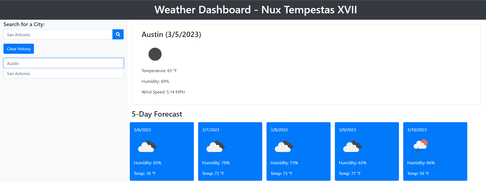

# Nux Tempestas XIV

## URL: https://daniellesison.github.io/nux-tempestas-xvii/

## Description

Display current day weather forecast in the dashboard when the user searches a city.

## Installations

N/A

## Usage

The user may use the weather dashboard by searching a City Name. The user may also see any previous searches and access them when clicked on. History may be cleared by utilizing the Clear History button or by clearing the history of the browser.

## Screenshot

Below is a screenshot of the sample weather dashboard:

## Credits

The following programs / guides were used to create this project:

<ul>
<li>Axios vs fetch() - https://blog.logrocket.com/axios-vs-fetch-best-http-requests/</li>
<li>Weather API Documentation - https://openweathermap.org/current</li>
</ul>

Thank you to the instructors and TA's that helped with this project.

## License

N/A
